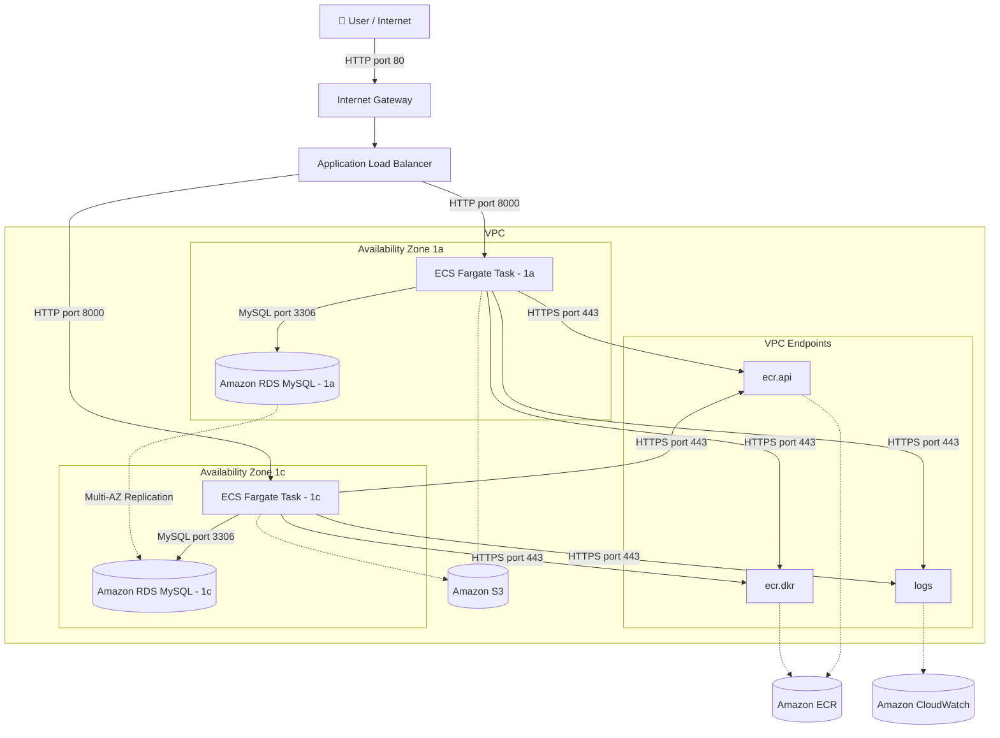

# AWS Standard 3-tier Architecture (IaC)

## 目的・背景
Terraform（IaC）の実務スキルを習得するためのトレーニングプロジェクト。
最終的には「実務で評価される、堅牢なポートフォリオ」として機能する作品にすることを目指している。

ただインフラを構築するだけでなく、ユーザー視点でインフラの仕組み（マルチAZや3層構造）を体感できる
**「リアルタイム・サーバー生存確認掲示板」** というアプリ（FastAPI）を載せて完成させる。

## アプリ仕様
1. 画面トップに、現在アクセスしているECSコンテナのAZ（`ap-northeast-1a` または `1c`）をデカデカと表示する
   - リロードするとALBによって1aと1cが切り替わるのが目に見える
2. フォームからメッセージを入力すると、プライベートサブネットのRDS（MySQL）にデータが保存され、一覧表示される

## 技術スタック
- **IaC**: Terraform (HCL)
- **Cloud**: AWS
- **App**: Python / FastAPI / SQLAlchemy / PyMySQL
- **Container**: Docker / Amazon ECS Fargate / Amazon ECR
- **DB**: Amazon RDS MySQL 8.0
- **CI/CD**: GitHub Actions (OIDC認証)
- **Tool**: Git, Terraform CLI, AWS CLI

## モジュール構成
```
modules/
├── vpc/   # VPC, サブネット, SG, VPCエンドポイント
├── alb/   # Application Load Balancer
├── ecs/   # ECS Fargate, ECR, タスク定義
├── rds/   # RDS MySQL (Multi-AZ)
└── ec2/   # Bastionサーバー
```

## Git運用方針
- `feature/*` ブランチで作業し、節目ごとにGitHubへPush
- 現在のブランチ: `feature/ecs-fargate`

## Amazon Q 引き継ぎ用コンテキスト
次回セッション開始時に以下を伝えると作業をスムーズに再開できる。

- このREADMEを `@README.md` で読み込ませる
- 現在の作業ブランチ・直前の作業内容を伝える
- エラーが出ている場合はターミナルの出力をそのまま貼る

## アーキテクチャ図

