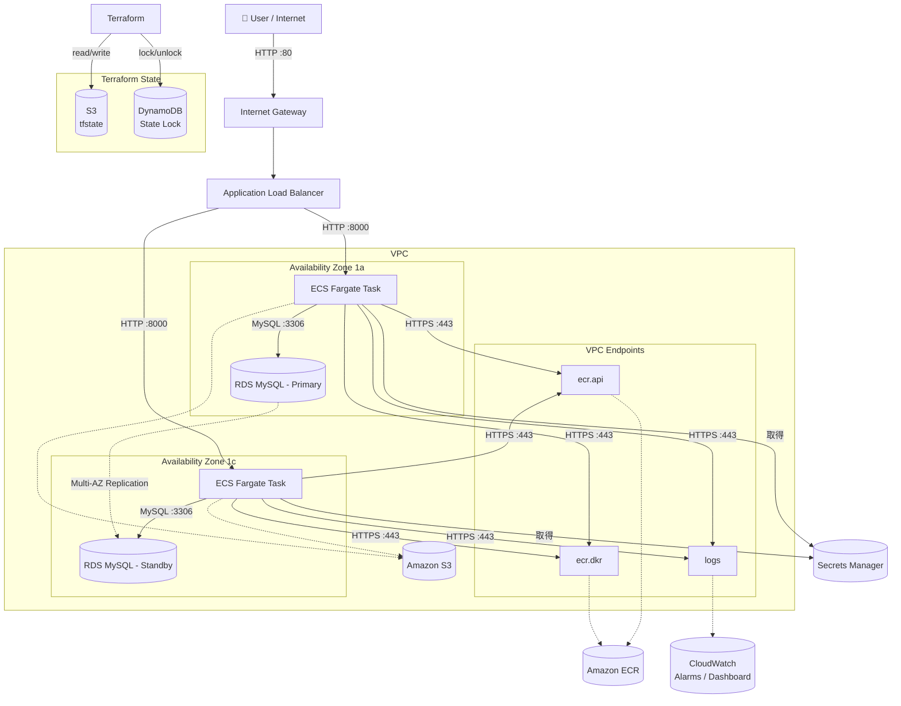

# AWS Standard 3-Tier Architecture (IaC)

Terraform を用いて AWS 上に本番運用を意識した3層アーキテクチャを構築したポートフォリオです。
インフラの構築だけでなく、セキュリティ・監視・CI/CD までをコードで一貫して管理しています。

## 概要

単なるインフラ構築にとどまらず、**ユーザーがマルチAZや3層構造の仕組みを体感できる**アプリケーションを載せて完成させています。

アプリ「**リアルタイム・サーバー生存確認掲示板**」の機能：
1. 現在アクセスしているECSコンテナのAZ（`ap-northeast-1a` / `1c`）をリアルタイム表示。リロードするたびにALBによってAZが切り替わる様子が目に見える
2. フォームからメッセージを投稿すると、プライベートサブネットのRDS（MySQL）に保存され一覧表示される

## 技術スタック

| カテゴリ | 使用技術 |
|---|---|
| IaC | Terraform (HCL) |
| Cloud | AWS |
| App | Python / FastAPI / SQLAlchemy / PyMySQL |
| Container | Docker / Amazon ECS Fargate / Amazon ECR |
| DB | Amazon RDS MySQL 8.0 |
| CI/CD | GitHub Actions (OIDC認証) |
| 認証情報管理 | AWS Secrets Manager |
| 監視 | Amazon CloudWatch Alarms / Dashboard |
| ツール | Git / Terraform CLI / AWS CLI |

## 設計のポイント

**セキュリティ**
- DB認証情報を `terraform.tfvars` の平文管理から **AWS Secrets Manager** に移行。ECSタスクが起動時にSecrets Managerから直接取得する構成
- BastionサーバーはSSMセッションマネージャーのみでアクセス。SGの22番ポートは閉じている
- NAT Gatewayを使わず **VPC Endpointで代替**することでプライベートサブネットからのAWS APIアクセスを閉域化しつつコストを削減
- GitHub ActionsのAWS認証は **OIDC**を使用。アクセスキーをシークレットに保存しない

**可用性**
- ECS Fargateを **マルチAZ（1a / 1c）** に2タスク配置
- RDSは **Multi-AZ構成**でフェイルオーバーに対応

**監視・運用**
- SLOに基づく **CloudWatch Alarm 6本**をTerraformでコード化（ALB・ECS・RDS）
- SNSトピックと連携したメール通知で異常を自動検知
- **CloudWatch Dashboard** でALB・ECS・RDSの主要メトリクスを一元可視化

**IaC管理**
- tfstateをS3バケットで一元管理、DynamoDBでステートロック（排他制御）
- インフラ・アプリ・監視・CI/CDすべてをコードで再現可能

## モジュール構成

```
modules/
├── vpc/        # VPC, サブネット, SG, VPCエンドポイント
├── alb/        # Application Load Balancer
├── ecs/        # ECS Fargate, ECR, タスク定義, IAMロール
├── rds/        # RDS MySQL (Multi-AZ)
├── ec2/        # Bastionサーバー（SSMアクセス）
├── secrets/    # AWS Secrets Manager（DB認証情報）
└── monitoring/ # CloudWatch Alarms, SNS, Dashboard

bootstrap/      # tfstate管理用S3バケット・DynamoDBテーブル（初回のみ手動apply）
```

## CI/CD フロー

```
git push (app/** の変更)
    ↓
GitHub Actions
    ├── Docker イメージをビルド
    ├── ECR にプッシュ（latest タグ）
    └── ECS サービスを強制デプロイ
```

- AWS認証はOIDCを使用（アクセスキー不要）
- `app/**` 配下の変更時のみワークフローが発火

## tfstate の管理

| リソース | 用途 |
|---|---|
| S3バケット `standard-3tier-tfstate` | tfstateの一元管理 |
| DynamoDBテーブル `standard-3tier-tfstate-lock` | ステートロック（排他制御） |

`bootstrap/` は初回のみ手動で `terraform apply` する。CI/CDには含めない。

## 作業開始ルーティン

1. インフラを再構築する
   ```bash
   terraform apply
   ```
2. ECRにイメージをプッシュする（GitHub Actionsを発火させる）
   ```bash
   echo "" >> app/README.md
   git add app/README.md
   git commit -m "ci: trigger deploy after terraform apply"
   git push origin main
   ```
3. GitHub → Actions タブでワークフローの完了を確認
4. `http://<ALB_DNS_NAME>` にアクセスしてアプリの動作確認

## terraform destroy 後の再構築手順

1. `terraform apply` でインフラを再構築
2. `app/` 配下を少し変更してコミット＆プッシュ（GitHub Actionsが発火してECRにイメージをプッシュ＆ECSにデプロイ）

- RDSのエンドポイントはTerraformが自動でECSに渡すのでコードの修正は不要
- ECRのイメージは削除されるので必ずStep 2が必要
- `bootstrap/` のS3・DynamoDBは `terraform destroy` の対象外なので再applyは不要

## アーキテクチャ図



## Amazon Q 引き継ぎ用コンテキスト

- このREADMEを `@README.md` で読み込ませる
- 現在の作業ブランチ・直前の作業内容を伝える
- エラーが出ている場合はターミナルの出力をそのまま貼る
