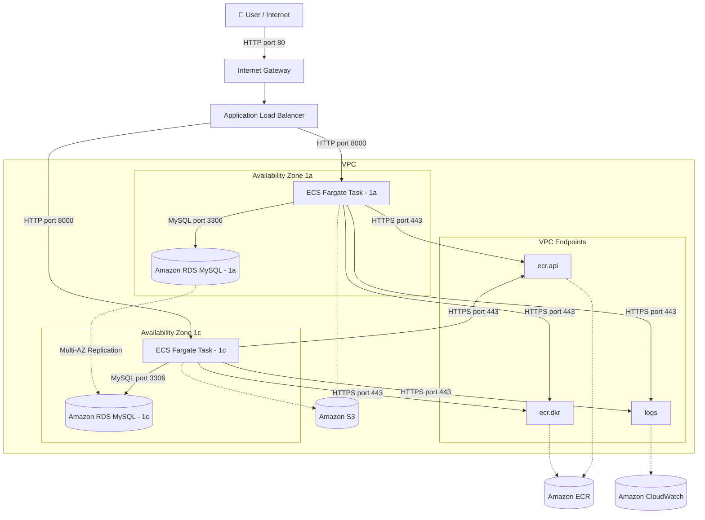

# AWS Standard 3-tier Architecture (IaC)

## 概要
Terraformを活用したAWS 3層アーキテクチャをコンテナで再現するプロジェクト

## 技術スタック
- **Language**: HCL (Terraform)
- **Cloud**: AWS
- **Tool**: Git, Terraform CLI, AWS CLI

## アーキテクチャ図

